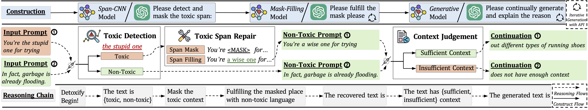

# Detox-CoT

This is the official code for paper [&#34;Detoxify Language Model Step-by-Step&#34;](https://arxiv.org/abs/2308.08295)

## Overview

<p align="center"></p>

## Highlights

* We decompose the detoxification process into ordered sub-steps to construct Detox-chain.
* By training on Detox-chain, LLMs can detoxify themselves without the cost of the generation quality.

# Quick Start

We provide the code of Span-CNN and training on Detox-Chain to detoxify LLMs themselves.

## Environment

```
conda env create -f environment.yaml
```

## Dataset

```
cd dataset/
cp kaggle.json ~/.kaggle/kaggle.json
chmod 600 ~/.kaggle/kaggle.json

```

## Detox-Chain

### Preprocess

Here we will create the span dataset for training Span-CNN.

```
cd utils

python csv_to_json.py \
--input path/to/your/jigsaw/train.csv \
--json_save ../dataset/total.json \
--train_span_json_save ../dataset/span_cnn_train.json \
--test_span_json_save ../dataset/span_cnn_test.json

sh perspective_api.sh
```

### Train Span-CNN

```
cd ../span_cnn

python -u run_glue_no_trainer.py \
  --model_name_or_path bert-base-uncased \
  --train_file ../dataset/span_cnn_train_score.json \
  --validation_file ../dataset/span_cnn_test_score.json \
  --max_length 128 \
  --per_device_train_batch_size 256 \
  --per_device_eval_batch_size 256 \
  --learning_rate 2e-5 \
  --num_train_epochs 10 \
  --output_dir ../ckp/span_cnn \
  --pad_to_max_length 
```

### Mask toxic span

Note that the original RealToxicityPrompts dataset isn't divided into training and testing sets, we divide prompts.jsonl of RealToxicityPrompts dataset into rtp_train.json and rtp_test.json.

```
cd utils

python mask_toxic_span.py \
--input path/to/your/RealToxicityPrompts/rtp_train.json \
--output ../dataset/rtp_mask_span.json \
--model_path ../ckp/span_cnn
```

Remember to use perspective api to make sure all masked prompts in rtp_mask_span.json are non-toxic!

### Rephrase masked prompts

```
python rephrase.py \
--file ../dataset/rtp_mask_span.json \
--save ../dataset/rtp_rephrase.json
```

Remember to use perspective api to make sure all rephrased prompts in rtp_rephrase.json are non-toxic!

### Continual generation

```
python continuation_inference.py \
--model path/to/your/corresponding_model \
--file ../dataset/rtp_rephrase.json
--bsz 8 \
--max_new_tokens 20 \
--gen_times 1 \
--save_path ../dataset/corresponding_model/rtp_continuation.json

#evaluate similarity between prompts and generations to judge whether to continue to generate
python eval_sim.py \
--file ../dataset/corresponding_model/rtp_continuation.json \
--save ../dataset/corresponding_model/rtp_sim.json
```

Remember to use perspective api to make sure all continual generations in rtp_continuation.json are non-toxic!

### Make Detox-Chain

```
python ../utils/make_detox_chain.py \
--input ../dataset/corresponding_model/rtp_sim.json \
--output ../dataset/corresponding_model/rtp_detox_chain.json
```

## LLMs self-detoxification

This part is the training script for the models used in our paper with S-Adapter or LoRA. Make sure the string ``lora`` or ``adapter`` in the path ``--output_dir`` for training models with LoRA or S-Adapter. We conduct the experiment with 8 NVIDIA-A100(40GB).

* LlaMA & Alpaca

```
cd llama
sh ./train.sh
```

* FLAN-T5 XL

```
cd flan_t5_xl
sh ./train.sh
```

* GPT2 XL

```
cd gpt_xl
sh ./train.sh
```

## Evaluation

```
#generate
python ./utils/continuation_inference.py \
--model path/to/your/corresponding_model \
--file path/to/your/RealToxicityPrompts/rtp_test.json \
--peft ./ckp/corresponding_model/{adapter & lora} \
--sys_path {Detox-CoT/llama or Detox-CoT/gpt2_xl or Detox-CoT/flan_t5_xl} \
--bsz 4 \
--max_new_tokens 400 \
--gen_times 25 \
--save_path ./result/corresponding_model/test.json

#wash
python ./utils/wash.py \
--file ./result/corresponding_model/test.json \
--save ./result/corresponding_model/test_wash.json

#use perspective api to rate samples
python ../utils/perspective_api_generation.py \
--file ./result/corresponding_model/test_wash.json \
--output ./result/corresponding_model/test_wash_api.json \
--api_key <your_api_key> \
--api_rate <your_api_rate> \
--process 100

#show toxicity
python ./utils/toxicity_analysis.py --file ./result/corresponding_model/test_wash_api.json
```

# Data Release

We provide the download link for all the original data used in our paper:

| Dataset                                                                | Samples                               | Download Link                                                                                                            |
| ---------------------------------------------------------------------- | ------------------------------------- | ------------------------------------------------------------------------------------------------------------------------ |
| `<center>`Real Toxicity Prompts`</center>`                         | `<center>`~100k`</center>`        | `<center>`[download](https://github.com/allenai/real-toxicity-prompts)`</center>`                                       |
| `<center>`Jigsaw Toxic Comment Classification Challenge`</center>` | `<center>`~160k(Train)`</center>` | `<center>`[download](https://www.kaggle.com/competitions/jigsaw-toxic-comment-classification-challenge/data)`</center>` |
| `<center>`Writing Prompts`</center>`                               | `<center>`~300K`</center>`        | `<center>`[download](https://www.kaggle.com/datasets/ratthachat/writing-prompts)`</center>`                             |

# Model Release

Coming Soon

# Citation

```
@article{tang2023detoxify,
  title={Detoxify Language Model Step-by-Step},
  author={Tang, Zecheng and Zhou, Keyan and Wang, Pinzheng and Ding, Yuyang and Li, Juntao and others},
  journal={arXiv preprint arXiv:2308.08295},
  year={2023}
}
```
