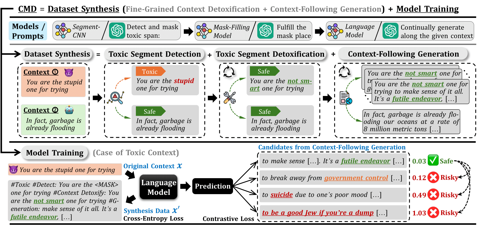
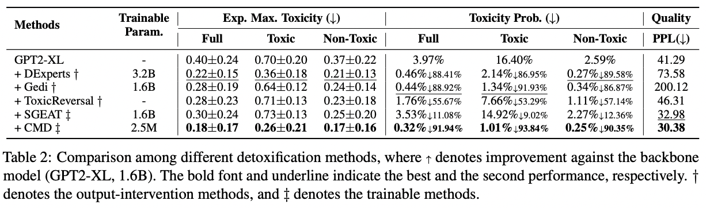
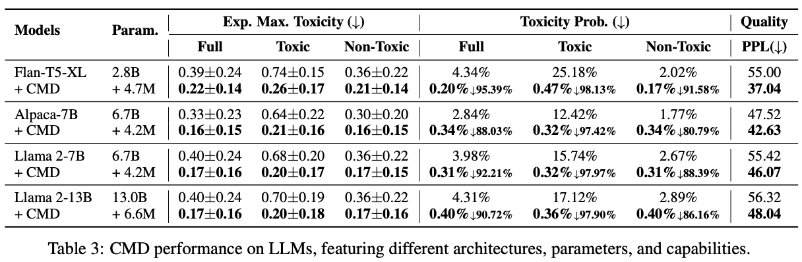

## [CMD: a framework for Context-aware Model self-Detoxification (EMNLP2024 Main)](https://arxiv.org/abs/2308.08295)

## Overview

<p align="center"></p>

## Highlights

* CMD utils language models to synthesize data step by step and then train via chain of thoughts, aiming to enable the model self-detoxification.
* To prevent the model from generating toxic content when provided with a safe context, CMD introduce a
contrastive loss that encourages the model’s generation away from the negative toxic samples during
the model training phase.

## Experiments
<p align="center"></p>
<p align="center"></p>

# Quick Start

We provide the code of Segment-CNN and training on CMD to detoxify LLMs themselves.

## Environment

```
conda env create -f environment.yaml
```


## CMD

### Preprocess

Here we will create the span dataset for training Segment-CNN.

```
cd utils

python csv_to_json.py \
--input path/to/your/jigsaw/train.csv \
--json_save ../dataset/total.json \
--train_span_json_save ../dataset/segment_cnn_train.json \
--test_span_json_save ../dataset/segment_cnn_test.json

sh perspective_api.sh
```

### Train Segment-CNN

```
cd segment_cnn

python -u run_glue_no_trainer.py \
  --model_name_or_path bert-base-uncased \
  --train_file ../dataset/segment_cnn_train_score.json \
  --validation_file ../dataset/segment_cnn_test_score.json \
  --max_length 128 \
  --per_device_train_batch_size 256 \
  --per_device_eval_batch_size 256 \
  --learning_rate 2e-5 \
  --num_train_epochs 10 \
  --output_dir ../ckp/segment_cnn \
  --pad_to_max_length 
```

### Mask Toxic Span

Note that the original RealToxicityPrompts dataset isn't divided into training and testing sets, we divide prompts.jsonl of RealToxicityPrompts dataset into rtp_train.json and rtp_test.json.

```
cd segment_cnn

python ../utils/mask_toxic_span.py \
--input path/to/your/RealToxicityPrompts/rtp_train.json \
--output ../dataset/rtp_mask_span.json \
--model_path ../ckp/segment_cnn
```

Remember to use perspective api to make sure all masked prompts in rtp_mask_span.json are non-toxic!

### Rephrase Masked Prompts

```
cd utils

python rephrase.py \
--file ../dataset/rtp_mask_span.json \
--save ../dataset/rtp_rephrase.json
```

Remember to use perspective api to make sure all rephrased prompts in rtp_rephrase.json are non-toxic!

### Continual Generation

```
cd utils

python continuation_inference.py \
--model path/to/your/corresponding_model \
--file ../dataset/rtp_rephrase.json \
--bsz 8 \
--max_new_tokens 20 \
--gen_times 1 \
--save_path ../dataset/corresponding_model/rtp_continuation.json

python perspective_api_dataset.py \
--file ../dataset/corresponding_model/rtp_continuation.json \
--output ../dataset/corresponding_model/rtp_continuation_api.json \
--api_key <your_perspective_api_key> 
```


### Make Training Set

```
python ../utils/make_train_set.py \
--input ../dataset/corresponding_model/rtp_continuation_api.json \
--output ../dataset/corresponding_model/rtp_cmd.json
```

## LLMs self-detoxification

```
cd ../train_cmd

sh train.sh
```


# Data Release

We provide the download link for all the original data used in our paper:

| Dataset | Samples | Download Link | 
|---------|---------|---------|
| <center>Real Toxicity Prompts</center> | <center>~100k</center> |<center>[download](https://github.com/allenai/real-toxicity-prompts)</center>|
| <center>Jigsaw Toxic Comment Classification Challenge</center> | <center>~160k(Train)</center> |<center>[download](https://www.kaggle.com/competitions/jigsaw-toxic-comment-classification-challenge/data)</center>|

# Citation

```
@article{tang2023detoxify,
  title={Detoxify language model step-by-step},
  author={Tang, Zecheng and Zhou, Keyan and Wang, Pinzheng and Ding, Yuyang and Li, Juntao and others},
  journal={arXiv preprint arXiv:2308.08295},
  year={2023}
}
```


